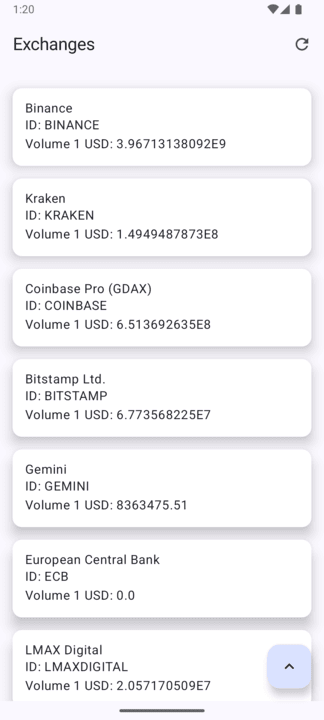
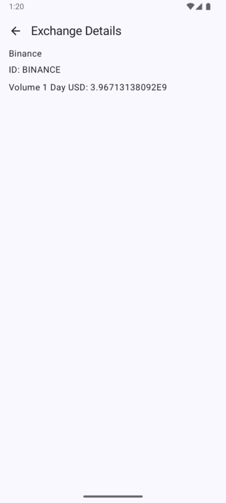

# Exchanges list

O aplicativo exchanges-list é um aplicativo Android que lista todas as bolsas de criptomoedas
disponíveis. Ele fornece aos usuários uma maneira simples e direta de visualizar uma lista
abrangente de bolsas e obter detalhes básicos.




## Arquitetura

O projeto utiliza arquitetura MVVM + Clean Architecture.

## Estrutura do projeto

O projeto é estruturado como um aplicativo Android modular, seguindo as melhores práticas de
desenvolvimento para projetos Android. Ele usa as seguintes bibliotecas e padrões:

- **Jetpack:** O projeto usa bibliotecas do Jetpack para fornecer uma experiência de usuário
  consistente e de alta qualidade. Isso inclui componentes como:
    - **Flow:** Para observar os dados e atualizar a IU automaticamente.
    - **ViewModel:** Para gerenciar os dados relacionados à IU e manter os dados durante as mudanças
      de configuração.
    - **Navigation:** Para fornecer navegação entre os diferentes destinos.
- **Kotlin:** A linguagem de programação usada para o desenvolvimento é Kotlin.
- **Dependências:** O projeto usa uma lista de dependências, incluindo:

    - **Dependências da biblioteca:**
        - androidx.appcompat:appcompat
        - androidx.core:core-ktx
        - androidx.lifecycle:lifecycle-runtime-ktx
        - androidx.activity:activity-compose
        - androidx.compose.ui:ui
        - androidx.compose.ui:ui-graphics
        - androidx.compose.ui:ui-tooling-preview
        - androidx.compose.material3:material3
        - androidx.lifecycle:lifecycle-viewmodel-compose
        - androidx.navigation:navigation-compose
        - junit:junit
        - androidx.test.ext:junit
        - androidx.test.espresso:espresso-core
        - androidx.compose.ui:ui-test-junit4
        - androidx.compose.ui:ui-tooling
        - androidx.compose.ui:ui-test-manifest
- **Arquitetura:** O projeto usa uma arquitetura de visualização de modelo para separar os
  componentes de IU dos componentes de dados.

## Como Executar

1. Clone o repositório:
    ```sh
    git clone https://github.com/ramirosneto/exchanges-list.git
    ```
2. Abra o projeto no Android Studio.
3. Compile e execute o aplicativo em um emulador ou dispositivo físico.

## Licença

Este projeto está licenciado sob a Licença GNU GPL v3.0.